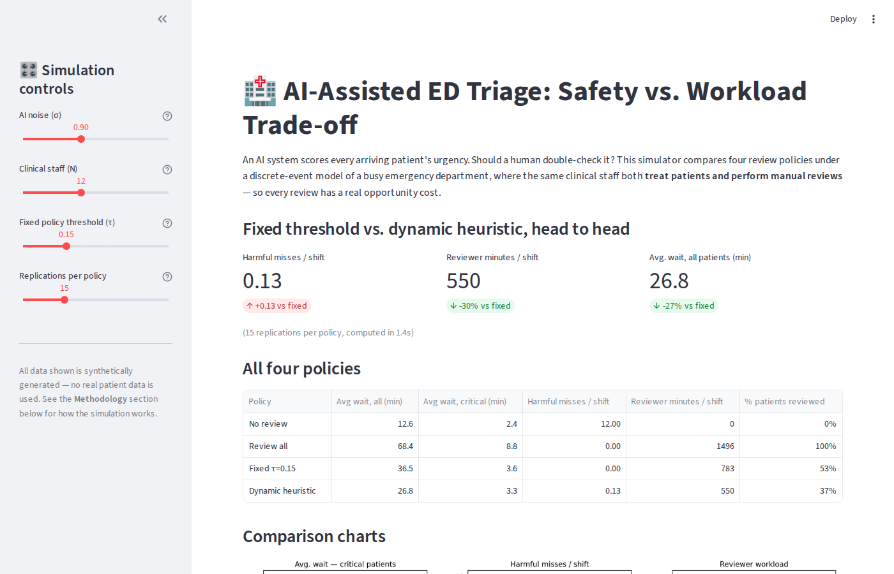

# AI-Assisted Emergency Department Triage: Simulation & Policy Comparison

An OR study of a hospital emergency department where an AI system scores each
arriving patient's severity, and the hospital must decide which patients get
a manual (human) review before treatment. The core trade-off: reviewing more
patients catches AI errors on truly critical cases, but consumes the same
clinical staff time needed to treat everyone else.

**[▶ Try the live interactive dashboard](https://YOUR-APP-NAME.streamlit.app)**



## Files

- `simulation.py` — core discrete-event simulation (built with [SimPy](https://simpy.readthedocs.io)).
  Patients arrive via a time-varying Poisson process; an AI model assigns a
  noisy severity score + confidence; a shared clinical-staff resource pool
  handles both manual reviews and treatment, queued by priority.
- `experiments.py` — runs replicated experiments (40 reps/policy), sweeps the
  review threshold to trace the safety/workload trade-off, and runs a
  sensitivity analysis over AI accuracy. Produces `figures/*.png` and `.csv`.
- `figures/` — output charts and raw result tables.
- `dashboard/app.py` — interactive [Streamlit](https://streamlit.io) app: adjust AI
  accuracy, staff levels, and review threshold live and see the safety/workload
  trade-off update in real time.

## Policies compared

| Policy | Description |
|---|---|
| No review | Always trust the AI's severity score |
| Review all | Every patient gets a manual review |
| Fixed τ (safe) | Review iff a risk score exceeds a constant threshold |
| **Dynamic heuristic** | Same risk-score rule, but the threshold adapts to real-time staff congestion — more thorough when idle, more selective when busy |

The risk score used for the review decision is
`(1 − confidence) × w(ai_severity)`, where `w` up-weights AI scores near the
critical/non-critical boundary — the region most likely to hide a true
emergency that the AI underestimated.

## Headline result

Across 40 replicated 12-hour shifts, the dynamic heuristic matches the safety
of a conservative fixed threshold (≈0 harmful misses — a truly critical
patient scored non-urgent by the AI and never corrected) while using **~31%
less reviewer time** and cutting average patient wait by **~27%**, by
concentrating review effort during quiet periods instead of applying it
uniformly all shift long.

## Reproducing

```bash
pip install -r requirements.txt
python3 experiments.py        # regenerate figures/*.png and *.csv

# interactive dashboard
cd dashboard
pip install -r requirements.txt
streamlit run app.py
```

## Deploying the dashboard (free)

1. Push this repo to GitHub (public).
2. Go to [share.streamlit.io](https://share.streamlit.io), sign in with GitHub.
3. "New app" → select this repo → set **main file path** to `dashboard/app.py`.
4. Deploy. You'll get a public URL like `https://your-app-name.streamlit.app`.

## Data

All data is synthetically generated (see `SimConfig` in `simulation.py`) —
no real patient data is used or required. Arrival rates, severity mix,
treatment-time distributions, and AI noise level are all configurable
parameters, documented inline.
